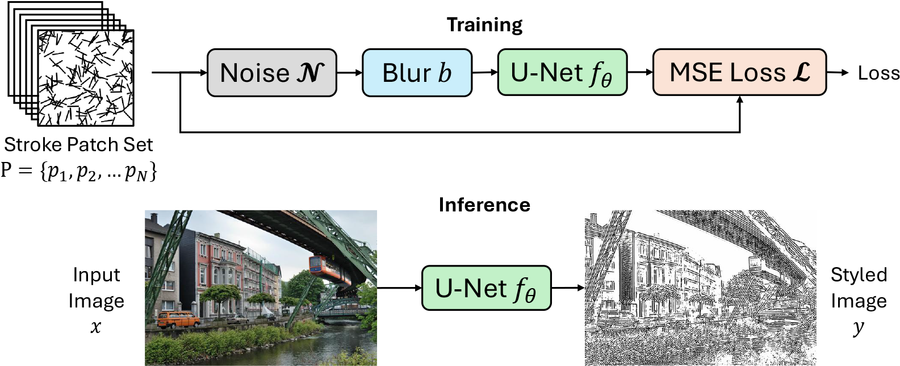

# Stroke Patches: Customizable Artistic Image Styling Using Regression


The code has been authored by: John Bronskill and Ian Jaffray.

## Dependencies
This code requires the following:
* Python 3.10 or greater
* PyTorch 2.71 or greater
* tqdm 4.67.1 or greater

## GPU Requirements
* To run a pretrained model, a GPU with 12GB or more memory.
* To train a set of stroke patches, a GPU with 24 GB or more memory.

## Installation
1. The pretrained models are large and are stored in Git Large File Storage (Git LFS). Before you do anything else, be sure that Git LFS is installed. To do this, run ```git lfs install```. If it says that it is initialized, go on the next step. Otherwise, install Git LFS following these instructions: [Git LFS Installation](https://docs.github.com/en/repositories/working-with-files/managing-large-files/installing-git-large-file-storage).
2. Clone this repository: ```git clone https://github.com/jfb54/stroke_patches.git```

## Usage
1. Set the current working directory to the root of the repo.
2. Set PYTHONPATH
* On linux run:
    * export PYTHONPATH=.
* On Windows run:
    * set PYTHONPATH=.

### Pretrained styles
To apply one of the built-in styles (Speedball Pen, Wet Brush, Diamond Brush, Cuneiform Brush, or Scribble Pencil) on one or more images:

1. Place any images to be rendered in a directory. The default is ```./input```.
2. Run any or all of the following command lines command lines. The processed images will be saved to ```./output```.

    ```python run.py --input_directory ./input --model_path ./pretrained_models/cuneiform_brush.pt```

    ```python run.py --input_directory ./input --model_path ./pretrained_models/diamond_brush.pt```

    ```python run.py --input_directory ./input --model_path ./pretrained_models/scribble_pencil.pt```

    ```python run.py --input_directory ./input --model_path ./pretrained_models/speedball_pen.pt```

    ```python run.py --input_directory ./input --model_path ./pretrained_models/wet_brush.pt```

### Custom styles
To train a model on a set of stroke patches:
1. Create a stroke patch set. We provide the code to generate the stroke patch set for the built-in styles. However, you can extend this code and design your own stroke patch set. The default is to save the stroke patch sets to: ```./stroke_patches/<name_of_style>```

    To generate the Cuneiform Brush stroke patches, run:

    ```python create_stroke_patches.py --patch_type cuneiform_brush```

    To generate the Diamond Brush stroke patches, run:

    ```python create_stroke_patches.py --patch_type diamond_brush --uniform_noise_low -500.0 --uniform_noise_high 500.0```

    To generate the Scribble Pencil stroke patches, run:

    ```python create_stroke_patches.py --patch_type scribble_pencil --gaussian_noise_std 500.0```

    To generate the Speedball Pen stroke patches, run:

    ```python create_stroke_patches.py --patch_type speedball_pen```

    To generate the Wet Brush stroke patches, run:

    ```python create_stroke_patches.py --patch_type wet_brush --gaussian_noise_std 750.0```

2. Train the model using a stroke patch set as training data:

    ```python train.py --data_directory <path to directory that contains the stroke patches> --batch_size <defaut is 4, but you can increase this if your GPU has more than 24GB> --epochs <default is 10, but you can train longer by setting this higher>,```

    Check the file ```train.py``` for additional options. By default, the trained model is saved to ```./checkpoints```. The training will save 2 models. The first is the one that has the best validation score, and the other is the final model after training for the specified number of epochs. In the next step, you can run the model to see how well it works.

3. Run the trained model.

    ```python run.py --input_directory ./input --model_path ./checkpoints/best_val.pt```

    or

    ```python run.py --input_directory ./input --model_path ./checkpoints/final_model.pt```

4. Write to us if you devise some great new styles. See the Contact section below. We can then incorporate the code in the repo and display images of the results on a page in the repo.

## How It Works


## Contact
To ask questions or report issues, please open an issue on the issues tracker.
